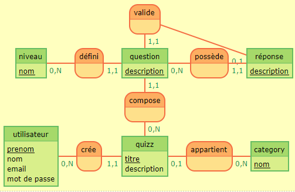

# Conception des données à partir d'un nouveau projet.

1. Gestion de projet (GDP)
2. Modélisation des données 
    * MCD
    * MLD
    * MPD
3. Model / Class
4. Relation des tables
5. Requêtes  

---
---
---
<br>

## 1. Recueil des besoins du client 

### *En vrac*: : 

Structure de base de donnee (bdd)  
Pas besoin de stocker les donnees  
PHPMYADMIN ???  
Plateforme de quizz  
Interface de connexion pour acceder aux quizz (les eleves)  
Creation de quizz : titre, thematique, sujets relatif, question, contexte, difficultes, auteur  
Questions avec difficulte et contexte  

---

### *Mise en forme* :

Plateforme de quizz

- Interface de connexion pour les etudiants afin de pouvoir acceder aux quizzes

- Quizz : Titre, Thematique, Sujets, Auteur, Questions  Question : Titre,  Reponses, Contexte, Difficulte

- Une seule bonne reponse par question  
- 4 reponses par question

- Page d'accueil avec les quizzes visibles pour tous  
- Quand on clique sur un quizz on accede a sa page

- Sur la page du quizz on a acces a toutes les questions (pas de tri specifique)  
- Bouton de validation a la fin du quizz pour acceder au recap

- Pas de developpement d'interface d'administration car le client possede deja une interface graphique pour administrer ses bases de donnees. Il faudra juste lui transmettre la base.

- Distinction lors de l'affichage du resultat entre bonne et mauvaise reponse.

### Chemin utilisateur

Login => liste des quizz => quiz (bouton de validation) => recap avec le score + questions bonnes / mauvaises

---
---
<br>

## 2. User stories (fonctionnalités)

### *On définie les rôles* : 
visiteur : utilisateur non connecte  
etudiant : utilisateur connecte

<br>

### *Et les users stories associées*: 

en tant que...|je veux...|afin de...|sprint
---|---|---|---
visiteur|acceder a l'interface de connexion|de me connecter et pouvoir repondre aux quizzes | 1
visiteur|acceder a la liste des quizzes (page d'accueil) | voir son titre, sa thematique, ses sujets | 1
etudiant |acceder a un quizz en particulier| voir les questions et ses reponses | 2
etudiant | repondre aux questions | ... | 2
etudiant | acceder aux resultats du quizz | connaitre mon score, mes bonnes reponses et savoir ou j'ai faute | 2
admin | CRUD des questions | ...

---
---
<br>

##  3. Wireframes (Mockups)

Les visuels de notre application 

---
---
<br>

## 4. Priorisation (on priorise nos user stories et on façonne notre découpage en sprints) => KANBAN

ToDo...|In Progress...|Done...
---|---|---
ETQ visiteur JBD d'une page d'accueil : <br> Faire la page d'acceuil |
ETQ visiteur JBD accéder aux questions d'un quiz: <br> -Sujet du quiz <br> - difficulté des questions |


---
---
<br>

# MCD (Modèle Conceptuel de Données)

Permet de modéliser et de structurer les données ainsi que leurs relations (associations)


```
valide, 11 question, 01 réponse

niveau: nom
défini, 0N niveau, 11 question
question: description
possède, 0N question, 11 réponse
réponse: description

compose, 11 question, 0N quizz

utilisateur: prenom, nom, email, mot de passe
crée, 0N utilisateur, 11 quizz
quizz: titre, description
appartient, 01 quizz, 0N category
category: nom
```



[MoCoDo](http://mocodo.wingi.net/)

[Kourou: MCD](https://kourou.oclock.io/ressources/fiche-recap/mcd-modele-conceptuel-de-donnees/)

---

<br>

# MLD (Modèle Logique de Données)

Le modèle logique découle directement du modèle conceptuel et est une étape nécessaire vers le modèle physique final de données( sois le fichier SQL )

```
utilisateur(id, first_name, last_name, email, password)
quiz(id, titre, description, #utilisateur(id), #category(id))
category(id, nom)
question(id, description, #quiz(id), #niveau(id), #answer(id))
niveau(id, nom)
reponse(id, description, #question(id))
```

Toute entité du MCD devient une table du MLD, les attributs deviennent les champs.

- Relation 1N , clé étrangère côté 1.
- Relation NN , nouvelle table contenant une clé étrangère des deux tables.
- Relation 11,  clé étrangère placé dans l'une des deux tables selon la logique de la relation entre les deux tables. (Les cas ou il y a un relation de type 11 est rare, en général ce sera un nouveau champs de la même table. )

[Kourou: MLD](https://kourou.oclock.io/ressources/fiche-recap/mld/)

---
<br>

# MPD ( Modèle Physique de Données)

Création du fichier data_sql

```javascript

DROP TABLE IF EXISTS "utilisateur" ;
DROP TABLE IF EXISTS "quiz" ;
DROP TABLE IF EXISTS "category" ;
DROP TABLE IF EXISTS "question" ;
DROP TABLE IF EXISTS "level" ;
DROP TABLE IF EXISTS "answer" ;

CREATE TABLE "utilisateur" (
"id" SERIAL PRIMARY KEY,
"first_name" TEXT NOT NULL,
"last_name" TEXT NOT NULL
"email" TEXT NOT NULL,
"password" TEXT NOT NULL
);

CREATE TABLE "quiz" (
"id" SERIAL PRIMARY KEY,
"titre" TEXT NOT NULL,
"description" TEXT,
"id_utilisateur" INT REFERENCES "utilisateur" ("id"),
);

CREATE TABLE "tag" (
"id" SERIAL PRIMARY KEY,
"name" TEXT NOT NULL
);
CREATE TABLE "level" (
"id" SERIAL PRIMARY KEY,
"name" TEXT NOT NULL,
);

CREATE TABLE "question" (
"id" SERIAL PRIMARY KEY,
"description" TEXT NOT NULL
"id_quiz" INT REFERENCES "quiz" ("id"),
"id_level" INT REFERENCES "niveau" ("id"),
"id_answer" INT REFERENCES "reponse" ("id")
);

CREATE TABLE "answer" (
"id" SERIAL PRIMARY KEY,
"id_question" INT REFERENCES "question" ("id")
);

CREATE TABLE "quiz_HAS_tag" (
"id_quiz" INT REFERENCES "quiz"("id"),
"id_tag" INT REFERENCES "tag"("id"),
PRIMARY KEY("id_quiz", "id_tag")
);

ALTER TABLE "question"
ADD FOREIGN KEY "id_answer" REFERENCES "answer"("id")

```

On ne peut pas mettre une clé étrangère dans une table qui fait référence à une table qui n'a pas encore été créer.
Dans ce cas on rajoute la clé étrangère à la fin du script avec `ALTER TABLE`

---
---
<br>

# Application

## Les models

Dans notre application, les tables de la BDD sont modélisé sous forme de class  ( en Programmation Orienté Objet ), cela nous permetra de formater les données que l'on récupère et d'appliquer nos requêtes directement sur les class.

L'utilisation d'un ORM ( object-relational-mapping) est fortement conseillé, c'est une interface qui se place entre l'application et la BDD et qui convertis les données envoyer ou reçu en type "Orienté Objet".

Exemple avec l'ORM Sequelize: 

```javascript
// On récupère sequelize, ainsi que le connecteur (qui sera donc toujours le meme pour tous les modèles - merci require !)
const Sequelize = require('sequelize'); // Require de sequilize qui a été NPM i
const sequelize = require('../database'); // Require du client initialisé avec sequilize

// Maintenant, nos modèles héritent du "Model" de sequelize, et non plus de notre CoreModel.
class Level extends Sequelize.Model {};

/**
 * Nécessaire, requis par Sequelize
 */
Level.init({
  // Premier paramètre : un objet qui définit le type des champs
  // Remaque : en cas de relation, on ne définit pas les champs "machin_id" !
  //   ils seront définis implicitement lorsqu'on définira nos relations
  name: Sequelize.STRING
},{
  // le 2ème paramètre contient les options de connections
  sequelize, // le connecteur
  tableName: "level", // nom de la table
});

// on exporte la class directement !
module.exports = Level;
```
---
### Un fichier par table: au dessus, la table level est modélisé dans la class Level et mise à disposition dans l'application. C'est sur cette class que seront effectué les requêtes qui lui sont liés.
---

```javascript
  
const Sequelize = require('sequelize');
const sequelize = require('../database');

class User extends Sequelize.Model {

  // va s'utiliser de cette facon : truc.fullname et pas truc.fullname()
  get fullname() {
    return this.firstname + ' ' + this.lastname;
  };

};

User.init({
  email: Sequelize.STRING,
  password: Sequelize.STRING,
  firstname: Sequelize.STRING,
  lastname: Sequelize.STRING,
  role: Sequelize.STRING
}, {
  sequelize,
  tableName: "user"
});


module.exports = User;
```

## Les relations

Un fichier index.js est crée pour regrouper toutes les relations des tables.


```javascript
// Ici j'importe tout mes models ...

const Answer = require('./answer');
const Level = require('./level');
const Question = require('./question');
const Quiz = require('./quiz');
const Tag = require('./tag');
const User = require('./user');

// RELATIONS 1:N

User.hasMany(Quiz, {
    foreignKey: 'user_id', // nom du champs clef etrangère
    as: 'quizzes' // le nom de la propriété qui contiendra les instances de quiz
});

Quiz.belongsTo(User, {
    foreignKey: 'user_id', // nom du champs clef etrangère
    as: 'author' // le nom de la propriété qui contiendra l'instance de user
});

Quiz.hasMany(Question, {
    foreignKey : 'quiz_id',
    as: 'questions' // quiz a plusieurs (has many) quoi ? questions
});

Question.belongsTo(Quiz, {
    foreignKey: 'quiz_id',
    as: 'quiz' // question a un seul (belongs to) quoi ? quiz
});

Level.hasMany(Question, {
    foreignKey: 'level_id',
    as: 'questions'
});

Question.belongsTo(Level, {
    foreignKey: 'level_id',
    as: 'level'
});

Question.hasMany(Answer, {
    foreignKey: 'question_id',
    as: 'answers'
});

Answer.belongsTo(Question, {
    foreignKey: 'question_id',
    as: 'question'
});

// RELATION 1:1

Question.belongsTo(Answer, {
    foreignKey: 'answer_id',
    as: 'correct'
});

// RELATION N:N

Quiz.belongsToMany(Tag, {
    as: 'tags',
    through: 'quiz_has_tag', // nom de la table de liaison
    foreignKey: 'quiz_id', // nom de la clef etrangère correspondant à cette classe (donc quiz)
    otherKey: 'tag_id' // nom de l'autre clef etrangère
});

Tag.belongsToMany(Quiz, {
    as: 'quizzes',
    through: 'quiz_has_tag', // nom de la table de liaison
    foreignKey: 'tag_id', // nom de la clef etrangère correspondant à cette classe (donc tag)
    otherKey: 'quiz_id' // nom de l'autre clef etrangère
});

// ... que j'exporte sous forme d'objet
module.exports = {
    Answer,
    Level,
    Question,
    Quiz,
    Tag,
    User
}
```

## Les requêtes 

Les requêtes à la BDD sont effectué dans les méthodes des controllers.

Exemple de requêtes (hors du controller) : 

```javascript
  
require('dotenv').config();

// On require tous nos models
const {Level, User, Quiz, Answer, Tag, Question} = require('./app/models');

// Récupérer le troisième user
User.findByPk(3).then(user => {
    console.log(user.email);
    // res.render('vue', {user});
});

// Récupérer tous les user
User.findAll().then(users => {
    console.log(users);
});

// Créer un level "Boss"
Level.create({name: 'Boss'}).then(level => {
    console.log(level);
});

// Mettre à jour les levels "Très difficile" en "Expert"
Level.update({
    name: 'Expert'
}, {
    where: {
        name: 'Très difficile'
    }
}).then(level => console.log(level));

// Supprimer le level "Beaucoup trop facile"
Level.destroy({
    where: {
        name: 'Beaucoup trop facile'
    }
}).then(level => console.log(level));


// Récupérer le premier quiz avec ses questions
Quiz.findByPk(1, {
    include: 'questions'
}).then(quiz=> {
    console.log(`${quiz.title} - ${quiz.description}`);
    for(const question of quiz.questions){
        console.log(question.question);
    }
    // res.render('vue', {user});
});

// Récupérer le 12ième quiz avec ses questions
Quiz.findByPk(12, {
    include: 'questions' // la jointure est faite
}).then(quiz => {
    console.log(`${quiz.title} - ${quiz.description}`);
    for(const question of quiz.questions){
        console.log(question.question);
    }
});


// Récupérer le troisième tag avec ses quizzes associés
Tag.findByPk(3, {
    include: 'quizzes'
}).then(tag => {
    console.log(tag.name);
    for(const quiz of tag.quizzes) {
        console.log(`${quiz.title} - ${quiz.description}`)
    }
});

// Récupérer le niveau débutant avec ses questions, et les réponses ainsi que la bonne pour chaque question

Level.findOne({ where: { name: 'Débutant' },
    include: { // ici on créé un objet dans l'include car on a plusieurs jointures à faire (en profondeur)
       association: 'questions', // on passe par association car on doit effectuer d'autres jointures à partir de cette table
       include: ['answers', 'correct'] // je recupere les reponses possibles pour chaque question et sa bonne reponse
    }
}).then(level => {
    console.log(`Le niveau est situé à : ${level.name}`);
    for(const question of level.questions){
        console.log(`Question : ${question.question}`);
        for(const answer of question.answers){
            console.log(`- ${answer.description}`);
        }
        console.log(`La bonne réponse est : ${question.correct.description}`)
    }
});


```
